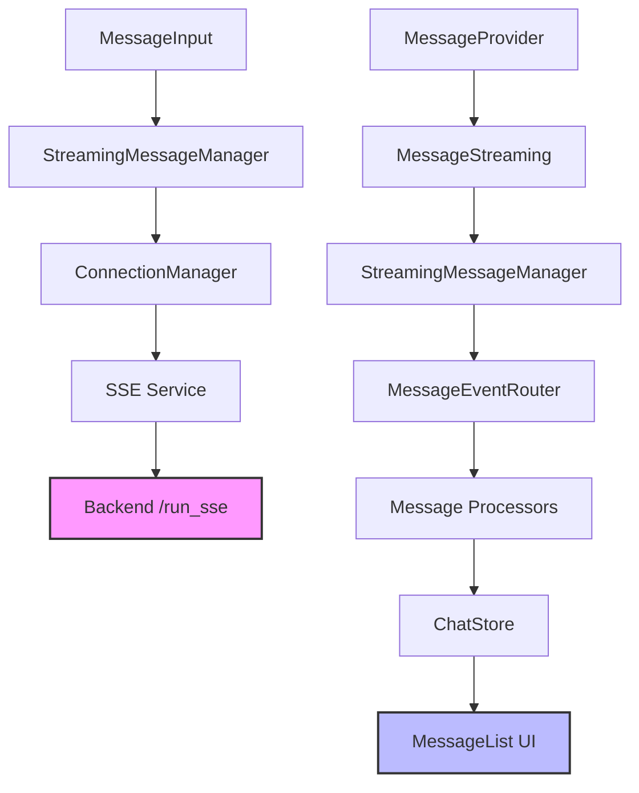
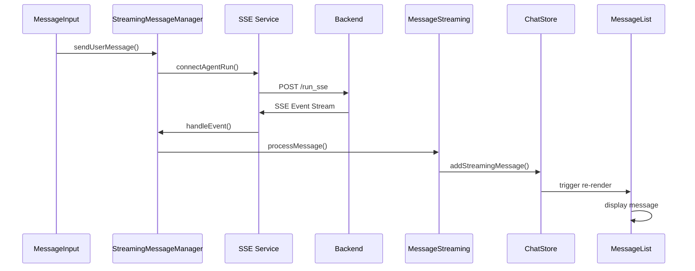

# Chat Message Streaming Fix Design

## Overview

The React chat application in `docker/react-chat` has a critical issue where streaming messages from agents are not properly processed and displayed. Messages remain stuck in "Streaming..." state indefinitely, indicating a breakdown in the streaming message pipeline.

## Problem Analysis

### Current Issues Identified

1. **Event Processing Gap**: Agent responses are not being converted to displayable messages
2. **SSE Event Routing**: Events from Server-Sent Events are not properly routed to the message display system
3. **Message Finalization**: Streaming messages lack proper completion detection and finalization
4. **Connection Management**: Multiple layers of streaming infrastructure are not coordinating effectively

### Symptoms

- Agent responses show "Streaming..." indefinitely
- Console shows successful API requests but no message processing
- User messages are displayed correctly, but agent responses fail
- Multiple agent setup calls suggesting connection/state issues

## Architecture Analysis

### Current Streaming Stack



### Identified Disconnection Points

1. **SSE Event to Message Conversion**: Events from SSE are not being properly converted to `Message` objects
2. **Message Router Integration**: The `MessageEventRouter` may not be receiving events from the SSE service
3. **Store Update Logic**: Messages may not be properly stored in `ChatStore`
4. **UI Refresh**: UI components may not be re-rendering with new message data

## Technical Root Cause

### Primary Issue: Event Handler Integration

The `messageApi.sendMessage()` calls `sseService.connectAgentRun()` but the response handling in the SSE service may not be properly integrated with the `StreamingMessageManager`. There appears to be a disconnect between:

1. **SSE Service** (`src/lib/api/sse.ts`) - Receives raw events
2. **Streaming Message Manager** (`src/lib/streaming/streaming-message-manager.ts`) - Processes events into messages
3. **Message Streaming Component** (`src/components/messaging/message-streaming.tsx`) - Updates UI

### Secondary Issue: Event Format Mismatch

The backend may be sending events in a format that doesn't match the expected `AgentEvent` interface, causing parsing failures or silent drops.

## Solution Architecture

### Enhanced Event Flow



### Core Fixes Required

1. **Event Handler Bridge**: Ensure SSE events are properly forwarded to StreamingMessageManager
2. **Message Accumulation Logic**: Fix partial message handling and content concatenation
3. **Finalization Triggers**: Implement robust message completion detection
4. **Error Handling**: Add comprehensive error logging and fallback mechanisms

## Implementation Strategy

### Phase 1: Event Integration Fix

**Objective**: Establish proper event flow from SSE to MessageStreaming

**Changes Required**:

1. **SSE Service Enhancement**
   - Ensure `handleEvent()` properly processes all event types
   - Add detailed logging for event processing
   - Verify event format compatibility

2. **StreamingMessageManager Integration**
   - Verify callback registration with SSE service
   - Ensure proper event routing to message processors
   - Add event validation and error handling

3. **Message Processing Chain**
   - Validate `MessageEventRouter` processor registration
   - Ensure `UserResponseProcessor` handles agent responses
   - Fix message accumulation logic in `MessageStreaming`

### Phase 2: Message Finalization Enhancement

**Objective**: Ensure streaming messages are properly completed and displayed

**Changes Required**:

1. **Completion Detection**
   - Enhanced event-based completion detection
   - Robust timeout-based fallback (2-5 seconds)
   - Multiple finalization triggers

2. **Content Accumulation**
   - Fix incremental content updates
   - Proper handling of partial vs. complete messages
   - Metadata preservation during accumulation

3. **UI State Management**
   - Ensure proper message state transitions
   - Fix "Streaming..." to final content display
   - Proper cleanup of streaming indicators

### Phase 3: Error Handling & Debugging

**Objective**: Add comprehensive error handling and debugging capabilities

**Changes Required**:

1. **Event Processing Debugging**
   - Detailed logging for each processing stage
   - Event format validation and logging
   - Connection state monitoring

2. **Fallback Mechanisms**
   - Graceful degradation when streaming fails
   - Automatic retry logic for failed connections
   - Error state recovery

3. **Performance Monitoring**
   - Track message processing latency
   - Monitor connection stability
   - Detect and resolve memory leaks

## Key Integration Points

### SSE Service to StreamingMessageManager

```typescript
// Enhanced event handling in SSE Service
private handleEvent(event: AgentEvent, connectionType: 'mainChat' | 'agentRun') {
  // Forward events to StreamingMessageManager for processing
  if (connectionType === 'agentRun') {
    this.streamingMessageManager?.handleAgentEvent(event);
  }

  // Existing handler logic
  const handlers = connectionType === 'mainChat' ? this.mainChatHandlers : this.agentRunHandlers;
  handlers.onMessage?.(event);
}
```

### Message Streaming Component Enhancement

```typescript
// Improved message accumulation logic
const handleIncomingMessage = useCallback((message: Message) => {
  const streamingKey = message.metadata?.streamingKey || message.metadata?.invocationId;

  if (message.metadata?.partial && streamingKey) {
    // Enhanced accumulation with proper content merging
    accumulateStreamingMessage(streamingKey, message);
  } else {
    // Direct message handling for complete messages
    finalizeMessage(message);
  }
}, []);
```

### Store Integration

```typescript
// Enhanced store operations for streaming
addStreamingMessage: (agentId: string, messageId: string, content: string) => {
  // Add with proper streaming metadata
  // Ensure UI updates trigger correctly
},

updateStreamingMessage: (messageId: string, content: string, metadata: MessageMetadata) => {
  // Accumulative content updates
  // Preserve message ordering and metadata
},

finalizeMessage: (messageId: string) => {
  // Mark message as complete
  // Trigger final UI refresh
  // Clean up streaming state
}
```

## Testing Strategy

### Unit Tests

1. **Event Processing Tests**
   - SSE event parsing and routing
   - Message accumulation logic
   - Finalization trigger conditions

2. **Integration Tests**
   - End-to-end message flow
   - Connection management
   - Error recovery mechanisms

### Manual Testing Protocol

1. **Basic Streaming Flow**
   - Send message to agent
   - Verify real-time content accumulation
   - Confirm proper message finalization

2. **Edge Cases**
   - Network interruption recovery
   - Malformed event handling
   - Concurrent message processing

3. **Performance Testing**
   - High-frequency message streams
   - Memory usage monitoring
   - Connection pool efficiency

## Success Criteria

1. **Functional Requirements**
   - Agent responses display properly without "Streaming..." stuck state
   - Real-time content accumulation works smoothly
   - Message ordering and threading maintained

2. **Performance Requirements**
   - Message display latency < 100ms
   - Memory usage remains stable during extended sessions
   - Connection recovery time < 5 seconds

3. **Reliability Requirements**
   - 99% message delivery success rate
   - Graceful handling of network interruptions
   - No memory leaks in long-running sessions

## Risk Mitigation

### Technical Risks

1. **Breaking Changes**: Implement changes incrementally with feature flags
2. **Performance Impact**: Monitor resource usage during development
3. **Backwards Compatibility**: Ensure existing message formats continue to work

### Rollback Strategy

1. **Modular Implementation**: Each phase can be independently rolled back
2. **Configuration Switches**: Allow dynamic switching between old/new logic
3. **Monitoring Alerts**: Automated detection of performance degradation
   - Network interruption recovery
   - Malformed event handling
   - Concurrent message processing

3. **Performance Testing**
   - High-frequency message streams
   - Memory usage monitoring
   - Connection pool efficiency

## Success Criteria

1. **Functional Requirements**
   - Agent responses display properly without "Streaming..." stuck state
   - Real-time content accumulation works smoothly
   - Message ordering and threading maintained

2. **Performance Requirements**
   - Message display latency < 100ms
   - Memory usage remains stable during extended sessions
   - Connection recovery time < 5 seconds

3. **Reliability Requirements**
   - 99% message delivery success rate
   - Graceful handling of network interruptions
   - No memory leaks in long-running sessions

## Risk Mitigation

### Technical Risks

1. **Breaking Changes**: Implement changes incrementally with feature flags
2. **Performance Impact**: Monitor resource usage during development
3. **Backwards Compatibility**: Ensure existing message formats continue to work

### Rollback Strategy

1. **Modular Implementation**: Each phase can be independently rolled back
2. **Configuration Switches**: Allow dynamic switching between old/new logic
3. **Monitoring Alerts**: Automated detection of performance degradation
