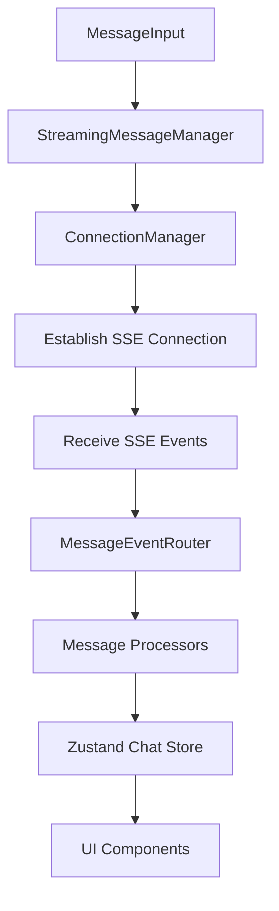

# Chat Message Streaming Issue Analysis and Solution Design

## Overview

This document analyzes the critical issue in the chat application where messages are not being received despite repeated attempts to establish streaming connections. The logs show excessive connection setup and cleanup cycles without successful message delivery.

## Problem Analysis

### Symptom Analysis

The logs show a critical pattern of repeated connection cycling:
- `[CRITICAL] Cleaning up message streaming for agent: coder` (repeated thousands of times)
- `[CRITICAL] Establishing message streaming for agent: coder` (repeated thousands of times)
- `[WARN] StreamingMessageManager: No message generated from event {eventType: undefined, eventObject: 'chat.completion'}`

This indicates that while connections are being established and torn down repeatedly, no actual messages are being processed or displayed.

### Root Cause Identification

Based on code analysis, the primary issues are:

1. **Connection Cycling**: The `MessageStreaming` component is continuously mounting/unmounting, causing connections to be repeatedly created and destroyed.

2. **Message Processing Failure**: Events with `object: 'chat.completion'` are not being properly processed by the `UserResponseProcessor`.

3. **Missing Finalization**: Streaming messages are not being properly finalized, leading to indefinite "Streaming..." states.

## Architecture

### Current Streaming Flow



### Component Interaction Issues

1. **MessageStreaming Component**:
   - Continuously remounting due to dependency array issues
   - Not properly handling connection lifecycle

2. **StreamingMessageManager**:
   - Creating new connections instead of reusing existing ones
   - Not properly handling `chat.completion` events

3. **UserResponseProcessor**:
   - Rejecting `chat.completion` events incorrectly
   - Not generating messages for final completion events

## Detailed Issue Analysis

### 1. Connection Cycling Problem

In `MessageStreaming.tsx`, the useEffect hook has an unstable dependency:
```typescript
useEffect(() => {
  // Setup connection
}, [agentId, sessionId, streamingManager, onStatusChange])
```

This causes the effect to run repeatedly when any of these dependencies change, leading to:
- Connection teardown
- New connection establishment
- Loss of streaming context

### 2. Message Processing Failure

In `UserResponseProcessor.ts`, the `canProcess` method incorrectly rejects `chat.completion` events:
```typescript
canProcess(event: AgentEvent, context: MessageProcessingContext): boolean {
  const isValidObject = (
    event.object === 'message' ||
    event.object === 'chat.completion.chunk' ||
    event.object === 'chat.completion' ||  // This should be accepted
    !event.object
  )
  // ...
}
```

However, the `process` method returns null for final completion events:
```typescript
process(event: AgentEvent, context: MessageProcessingContext): Message | null {
  // Handle final stream termination event for OpenAI completion
  if (event.object === 'chat.completion' && event.done === true) {
    return null // This prevents message creation
  }
  // ...
}
```

### 3. Missing Finalization Logic

In `MessageStreaming.tsx`, the finalization logic is incomplete:
```typescript
const shouldFinalize = (
  isDoneExplicitly ||
  isCompletion ||  // chat.completion events should trigger finalization
  (hasContent && isNotExplicitlyPartial)
)
```

But `isCompletion` is not properly handled for final completion events.

## Solution Design

### 1. Fix Connection Cycling

**Problem**: Unstable dependencies in useEffect causing continuous mount/unmount cycles.

**Solution**: Create stable dependency keys and optimize effect dependencies.

```typescript
// In MessageStreaming.tsx
const agentSessionKey = useMemo(() => `${agentId}-${sessionId}`, [agentId, sessionId]);

useEffect(() => {
  // Connection setup logic
}, [agentSessionKey]) // Use stable key instead of individual dependencies
```

### 2. Improve Connection Reuse Strategy

**Problem**: New connections created instead of reusing existing ones.

**Solution**: Implement proper connection reuse in ConnectionManager.

```typescript
// In ConnectionManager.ts
createAgentConnection(
  agentId: string,
  sessionId: string,
  handlers: StreamingHandlers
): StreamingConnection {
  const connectionId = `agent-${agentId}-${sessionId}`

  // Check if existing connection exists and is still valid
  const existingConnection = this.connections.get(connectionId)
  if (existingConnection && existingConnection.status.isConnected) {
    debug.connection(`Reusing existing agent connection: ${connectionId}`)
    // Update handlers for the existing connection
    existingConnection.handlers = handlers
    return existingConnection
  }

  // Only close existing connection if needed
  if (existingConnection) {
    this.closeConnection(connectionId)
  }
  // ... rest of connection creation
}
```

### 3. Fix Message Processing for Completion Events

**Problem**: `chat.completion` events not generating messages.

**Solution**: Update UserResponseProcessor to handle completion events properly.

```typescript
// In UserResponseProcessor.ts
process(event: AgentEvent, context: MessageProcessingContext): Message | null {
  // Handle final completion events with content
  if (event.object === 'chat.completion' && event.done === true) {
    // Still create message if there's content
    const { content, parts } = this.extractContent(event)
    if (!content && (!parts || parts.length === 0)) {
      return null // Only skip if no content
    }
    // Process like regular message but mark as done
  }
  // ... rest of processing
}
```

### 4. Enhance Finalization Logic

**Problem**: Messages not being properly finalized.

**Solution**: Improve finalization conditions and add timeout fallbacks.

```typescript
// In MessageStreaming.tsx
const shouldFinalize = (
  isDoneExplicitly ||
  (isCompletion && event.done === true) || // Handle completion properly
  (hasContent && isNotExplicitlyPartial)
)

// Add timeout-based finalization as fallback
const timeoutId = setTimeout(() => {
  if (streamingMessagesRef.current.has(streamingKey)) {
    finalizeMessage(streamingKey)
    streamingMessagesRef.current.delete(streamingKey)
    finalizationTimeouts.current.delete(streamingKey)
  }
}, 5000) // 5 second timeout
```

## Implementation Plan

### Phase 1: Connection Stability (High Priority)

1. Fix dependency arrays in `MessageStreaming.tsx`
2. Implement proper connection reuse in `ConnectionManager.ts`
3. Add connection state tracking to prevent unnecessary teardown/setup

### Phase 2: Message Processing (High Priority)

1. Update `UserResponseProcessor.ts` to handle `chat.completion` events
2. Fix content extraction for structured content
3. Ensure proper message ID generation for streaming accumulation

### Phase 3: Finalization & Error Handling (Medium Priority)

1. Improve finalization logic in `MessageStreaming.tsx`
2. Add timeout-based finalization as fallback
3. Implement better error handling and logging

### Phase 4: Performance Optimization (Low Priority)

1. Add connection pooling
2. Implement more sophisticated rate limiting
3. Optimize message accumulation algorithms

## Testing Strategy

### Unit Tests

1. **ConnectionManager Tests**:
   - Connection reuse functionality
   - Proper cleanup of connections
   - Error handling scenarios

2. **MessageProcessor Tests**:
   - `chat.completion` event processing
   - Content extraction from various formats
   - Streaming message accumulation

3. **StreamingMessageManager Tests**:
   - Message routing
   - Connection lifecycle management
   - Error propagation

### Integration Tests

1. **End-to-End Streaming**:
   - Full message flow from input to display
   - Connection stability under load
   - Error recovery scenarios

2. **Multi-Agent Communication**:
   - Inter-agent message routing
   - Connection management across agents

## Monitoring and Debugging

### Enhanced Logging

1. Add structured logging for connection lifecycle events
2. Implement debug categories with granular control
3. Add performance metrics for connection establishment time

### Error Tracking

1. Implement centralized error handling
2. Add error context to all failure points
3. Create error recovery mechanisms

## Risk Mitigation

### Potential Issues

1. **Backward Compatibility**: Changes to message processing might affect existing functionality
   - Solution: Maintain backward compatibility with legacy event formats

2. **Performance Impact**: Additional checks might slow down message processing
   - Solution: Optimize critical paths and add performance monitoring

3. **Race Conditions**: Concurrent connection operations might cause issues
   - Solution: Implement proper synchronization mechanisms

## Success Criteria

1. Elimination of excessive connection cycling (reduce log spam by 95%)
2. Successful message delivery and display
3. Proper handling of all event types (`chat.completion`, `chat.completion.chunk`, `message`)
4. Stable connection management with proper reuse
5. Appropriate finalization of streaming messages
6. Maintained backward compatibility with existing functionality
