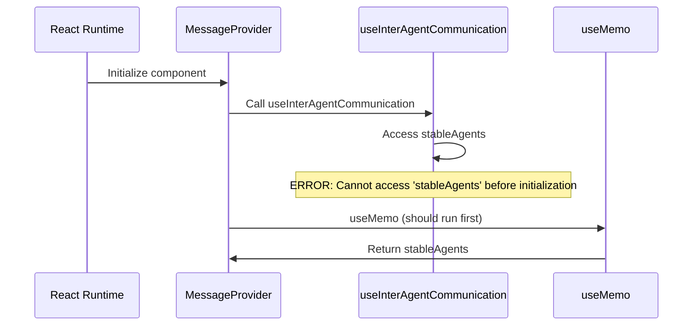
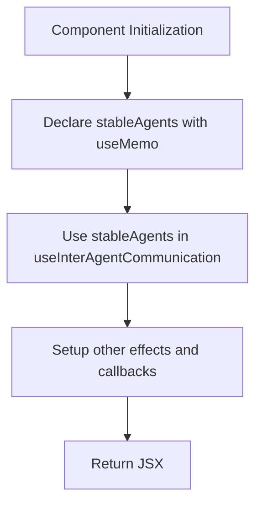
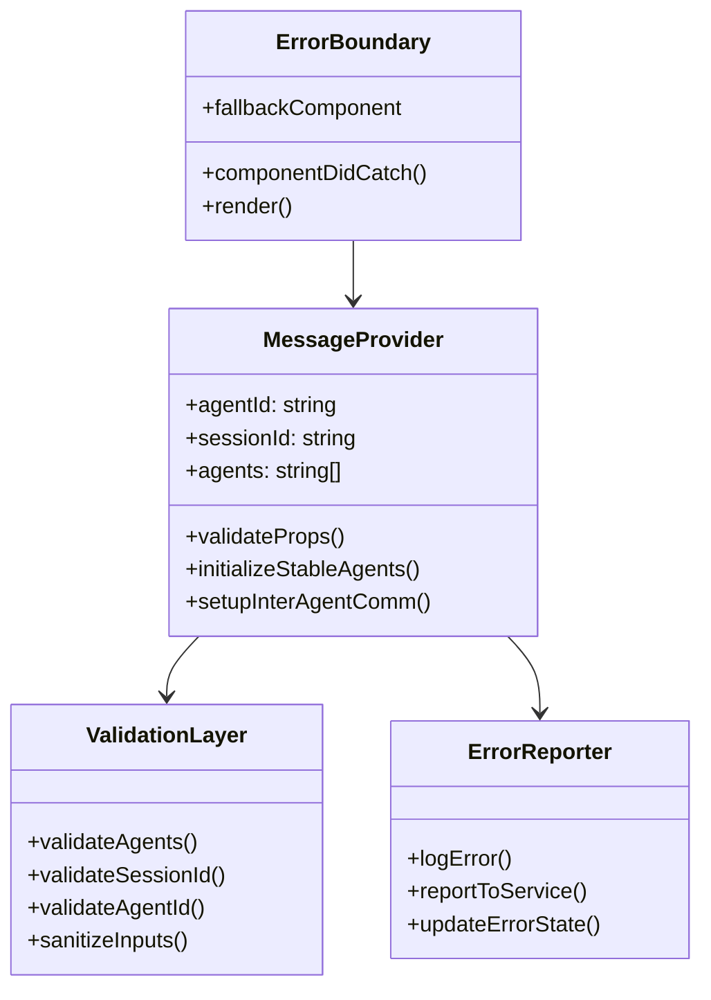
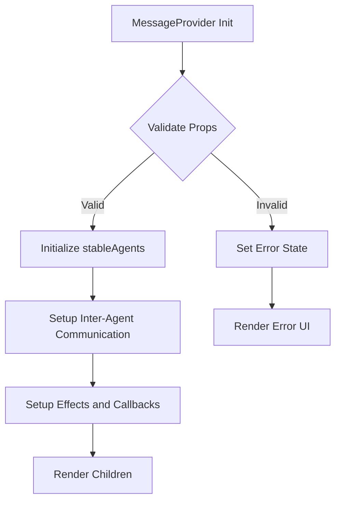

# Error Handling Design for Chat Component Initialization

## Overview

This design addresses a critical runtime error in the React chat application where `stableAgents` is accessed before initialization in the `MessageProvider` component. The error occurs due to improper variable declaration order in React hooks, leading to a temporal dead zone issue.

## Architecture

### Error Analysis

The current error stems from a variable hoisting issue in the `MessageProvider` component:



### Root Cause

The variable `stableAgents` is referenced in `useInterAgentCommunication` hook call before it's declared by the `useMemo` hook below it, creating a temporal dead zone violation.

## Error Handling Strategy

### 1. Immediate Fix - Variable Declaration Order

**Problem**: Hook execution order violates JavaScript temporal dead zone rules.

**Solution**: Reorganize variable declarations to follow proper dependency order.



### 2. Defensive Programming Patterns

**Null Safety Checks**:
- Add default value fallbacks for undefined variables
- Implement early return patterns for invalid states
- Use optional chaining for object property access

**Hook Dependencies Validation**:
- Validate all hook dependencies before usage
- Add runtime type checking for critical parameters
- Implement graceful degradation for missing data

### 3. Error Boundaries and Recovery

**Component-Level Error Handling**:
- Wrap MessageProvider in error boundary
- Implement fallback UI for initialization failures
- Add retry mechanisms for recoverable errors

**State Management Integration**:
- Sync error states with global store
- Provide error context to child components
- Maintain error history for debugging

## Component Architecture

### Error-Safe MessageProvider Structure



### Hook Execution Flow



## Implementation Specifications

### 1. Variable Declaration Order Fix

**Current Problematic Code**:
```typescript
// ❌ WRONG: Using stableAgents before declaration
const interAgentComm = useInterAgentCommunication({
  agents: stableAgents, // ReferenceError here
  sessionId,
  userId: 'user'
})

// Declaration comes after usage
const stableAgents = useMemo(() => {
  return agents.length > 1 ? agents : [];
}, [agents.length, agents.join(',')]);
```

**Fixed Code Structure**:
```typescript
// ✅ CORRECT: Declare before use
const stableAgents = useMemo(() => {
  return agents.length > 1 ? agents : [];
}, [agents.length, agents.join(',')]);

const interAgentComm = useInterAgentCommunication({
  agents: stableAgents,
  sessionId,
  userId: 'user'
})
```

### 2. Enhanced Error Handling Layer

**Input Validation**:
```typescript
// Validate and sanitize inputs
const validateInputs = useMemo(() => {
  const errors: string[] = [];

  if (!agentId?.trim()) errors.push('Agent ID is required');
  if (!sessionId?.trim()) errors.push('Session ID is required');
  if (!Array.isArray(agents)) errors.push('Agents must be an array');

  return {
    isValid: errors.length === 0,
    errors
  };
}, [agentId, sessionId, agents]);
```

**Safe State Initialization**:
```typescript
// Safe memoization with error handling
const stableAgents = useMemo(() => {
  try {
    if (!Array.isArray(agents)) {
      console.warn('MessageProvider: agents prop is not an array, defaulting to empty array');
      return [];
    }

    return agents.length > 1 ? agents : [];
  } catch (error) {
    console.error('MessageProvider: Error processing agents array:', error);
    return [];
  }
}, [agents]);
```

### 3. Error Boundary Integration

**Component Wrapper**:
```typescript
function MessageProviderWithErrorBoundary(props: MessageProviderProps) {
  return (
    <ErrorBoundary
      fallback={<MessageProviderErrorFallback />}
      onError={(error, errorInfo) => {
        console.error('MessageProvider Error:', error, errorInfo);
        // Report to error tracking service
      }}
    >
      <MessageProvider {...props} />
    </ErrorBoundary>
  );
}
```

## Testing Strategy

### Unit Tests

**Hook Execution Order Tests**:
- Test variable declaration order
- Verify no temporal dead zone violations
- Test with various input combinations

**Error Scenario Tests**:
- Invalid agent arrays
- Missing required props
- Network connection failures
- Cleanup on unmount

### Integration Tests

**Component Lifecycle Tests**:
- Full initialization flow
- Error recovery scenarios
- State synchronization with store
- Child component rendering

**Error Boundary Tests**:
- Error catching and reporting
- Fallback UI rendering
- Recovery after error resolution

### End-to-End Tests

**User Journey Tests**:
- Complete chat initialization flow
- Multi-agent communication setup
- Error handling in production scenarios
- Performance under error conditions

## Monitoring and Observability

### Error Tracking

**Metrics to Monitor**:
- Initialization failure rate
- Error recovery success rate
- Time to error resolution
- Impact on user experience

**Logging Strategy**:
- Structured error logging with context
- Performance metrics for initialization
- User action correlation with errors
- Error pattern analysis

### Health Checks

**Component Health Indicators**:
- Successful initialization rate
- Inter-agent communication status
- Memory usage during error states
- Recovery time from failures

## Performance Considerations

### Optimization Strategies

**Memory Management**:
- Proper cleanup of event listeners
- Memoization of expensive computations
- Avoiding memory leaks in error states

**Rendering Performance**:
- Minimize re-renders during error recovery
- Optimize error boundary fallback components
- Efficient state updates for error handling

### Resource Usage

**Connection Management**:
- Graceful cleanup of failed connections
- Resource pooling for error recovery
- Timeout handling for initialization

## Security Considerations

### Input Sanitization

**Data Validation**:
- Sanitize agent IDs and session IDs
- Validate array inputs for injection attacks
- Escape user-provided error messages

**Error Information Exposure**:
- Avoid exposing sensitive data in error messages
- Sanitize error logs for production
- Control error detail levels by environment
