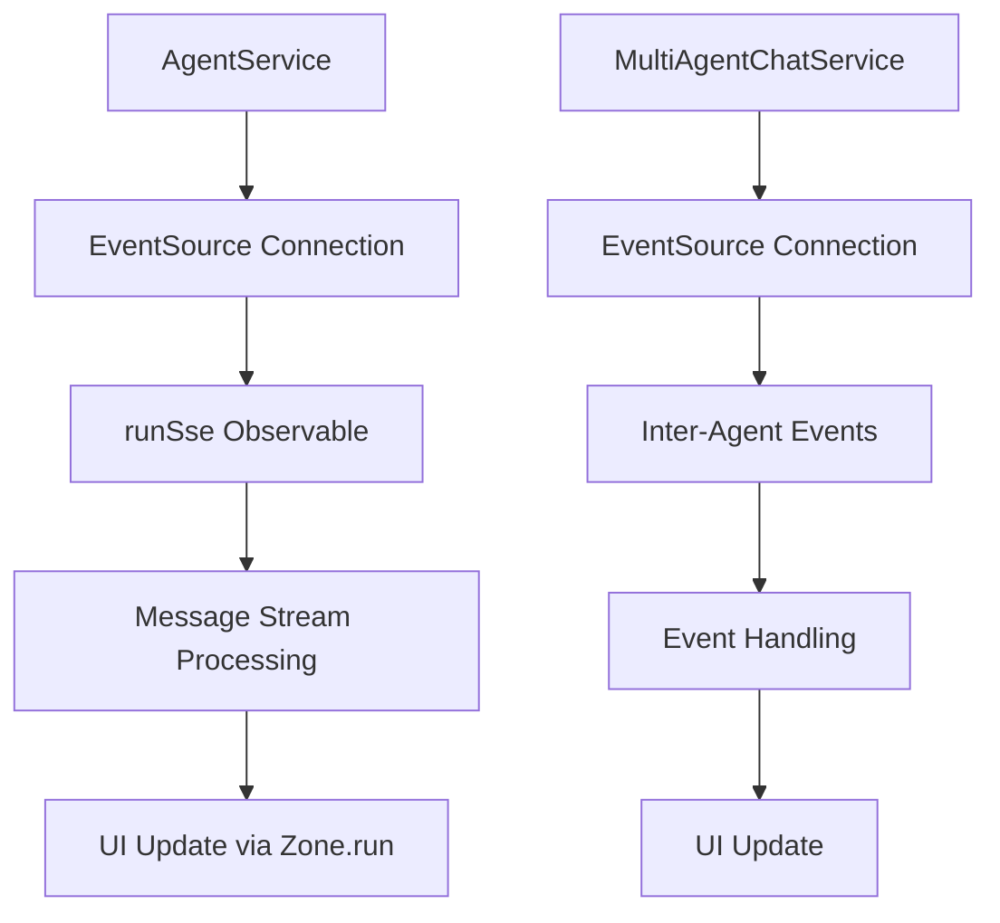
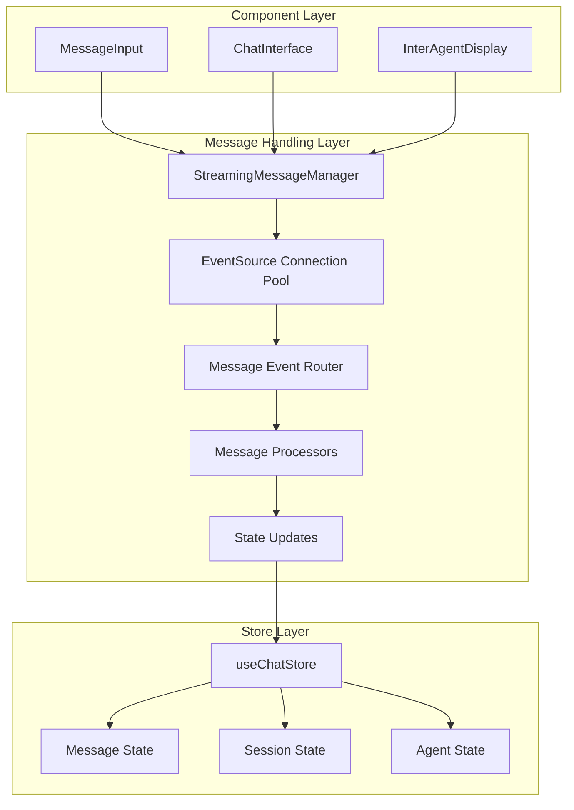
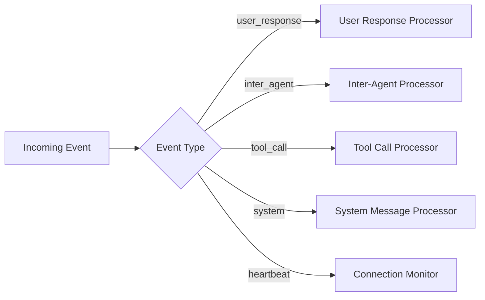
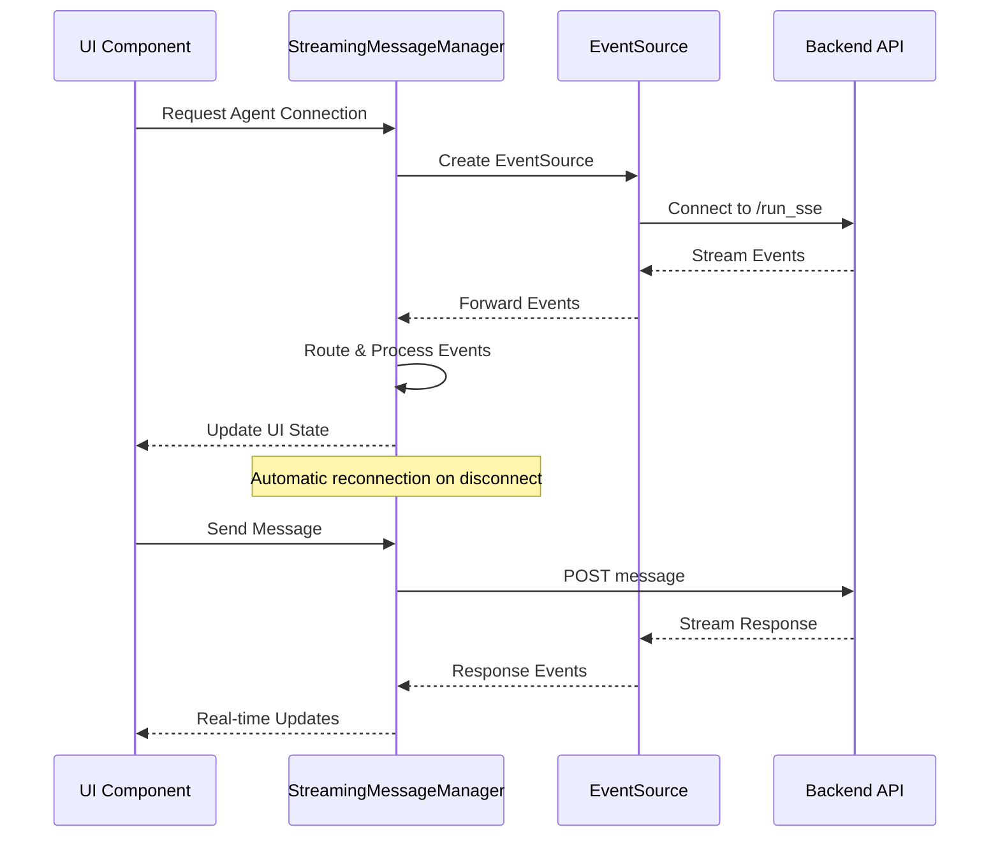
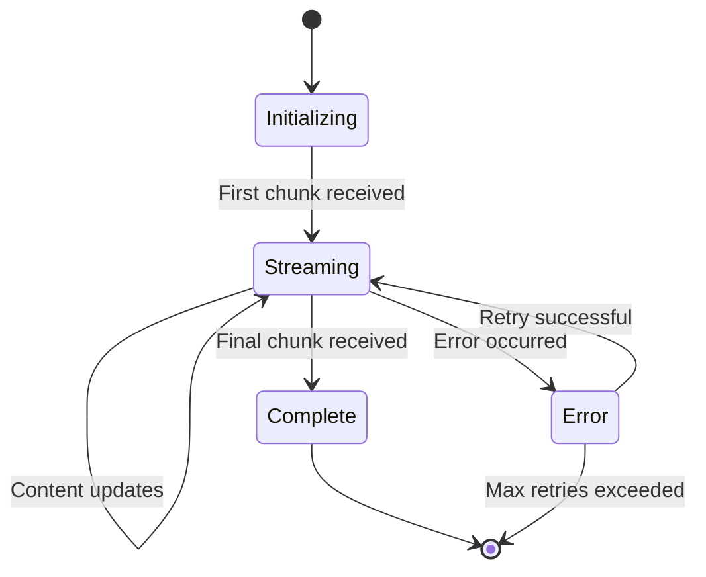

# Message Handling Refactor Design

## Overview

This design outlines the refactoring of the React chat application's message handling system to simplify and improve the processing of streaming messages from agents. The current implementation is overly complex and scattered across multiple components. The new design will create a unified EventSource-based message component that handles both user-to-agent communication and inter-agent communication efficiently.

## Current State Analysis

### Angular App Implementation (Reference)
The Angular application demonstrates a clean EventSource-based approach:



Key strengths of the Angular implementation:
- Direct EventSource usage with clean Observable pattern
- Separate services for different message types
- Proper error handling and reconnection logic
- Zone-based change detection for UI updates

### React App Current Issues
The React application has several architectural problems:

1. **Scattered Message Handling**: Message logic is split between `MessageInput`, `useAgentConnection`, SSE service, and store
2. **Complex State Management**: Multiple state updates for the same message stream
3. **Overlapping Responsibilities**: Both hooks and components handle similar messaging concerns
4. **Inefficient Streaming**: Multiple EventSource connections for different purposes
5. **State Synchronization Issues**: Race conditions between different message handlers

## Architecture Design

### New Message Architecture



### Core Components

#### 1. StreamingMessageManager
A centralized service that manages all EventSource connections and message routing:

```typescript
interface StreamingMessageManager {
  // Connection Management
  establishAgentConnection(agentId: string, sessionId: string): void
  establishInterAgentConnection(agents: string[], sessionId: string): void
  closeConnection(connectionId: string): void

  // Message Handling
  sendUserMessage(agentId: string, content: string): Promise<void>
  sendInterAgentMessage(request: MultiChatRequest): Promise<void>

  // Event Streaming
  onMessage(callback: MessageCallback): void
  onInterAgentEvent(callback: InterAgentCallback): void
  onConnectionChange(callback: ConnectionCallback): void
}
```

#### 2. Message Event Router
Routes incoming events to appropriate processors based on event type:



#### 3. Message Processors
Specialized processors for different message types:

- **UserResponseProcessor**: Handles streaming responses from agents to users
- **InterAgentProcessor**: Manages communication between agents
- **ToolCallProcessor**: Processes tool invocations and responses
- **SystemMessageProcessor**: Handles system notifications and status updates

### EventSource Connection Strategy

#### Connection Types
1. **Agent Run Connection**: For user-to-agent communication
2. **Multi-Agent Connection**: For inter-agent communication monitoring
3. **System Events Connection**: For system-wide notifications (optional)

#### Connection Lifecycle Management



## Component Design

### Unified Message Component

```typescript
interface MessageStreamingProps {
  agentId: string
  sessionId: string
  onMessageUpdate?: (message: Message) => void
  onStatusChange?: (status: ConnectionStatus) => void
}

const MessageStreaming: React.FC<MessageStreamingProps> = ({
  agentId,
  sessionId,
  onMessageUpdate,
  onStatusChange
}) => {
  const streamingManager = useStreamingManager()

  useEffect(() => {
    const connection = streamingManager.establishAgentConnection(agentId, sessionId)

    const unsubscribeMessage = streamingManager.onMessage((message) => {
      onMessageUpdate?.(message)
    })

    const unsubscribeStatus = streamingManager.onConnectionChange((status) => {
      onStatusChange?.(status)
    })

    return () => {
      connection.close()
      unsubscribeMessage()
      unsubscribeStatus()
    }
  }, [agentId, sessionId])

  return null // This is a logic-only component
}
```

### Simplified Message Input

```typescript
const MessageInput: React.FC<MessageInputProps> = ({ agentId }) => {
  const [message, setMessage] = useState("")
  const [isLoading, setIsLoading] = useState(false)
  const streamingManager = useStreamingManager()

  const handleSend = async () => {
    if (!message.trim()) return

    setIsLoading(true)
    try {
      await streamingManager.sendUserMessage(agentId, message.trim())
      setMessage("")
    } catch (error) {
      toast.error("Failed to send message")
    } finally {
      setIsLoading(false)
    }
  }

  // UI rendering logic...
}
```

### Inter-Agent Communication Hook

```typescript
const useInterAgentCommunication = (agents: string[], sessionId: string) => {
  const streamingManager = useStreamingManager()
  const { addInterAgentEvent } = useChatStore()

  useEffect(() => {
    if (agents.length === 0) return

    const connection = streamingManager.establishInterAgentConnection(agents, sessionId)

    const unsubscribe = streamingManager.onInterAgentEvent((event) => {
      addInterAgentEvent(event)
    })

    return () => {
      connection.close()
      unsubscribe()
    }
  }, [agents, sessionId])
}
```

## State Management Design

### Simplified Store Operations

```typescript
interface ChatStoreActions {
  // Message Management
  addStreamingMessage(agentId: string, messageId: string, initialContent: string): void
  updateStreamingMessage(messageId: string, content: string, metadata: MessageMetadata): void
  finalizeMessage(messageId: string): void

  // Session Management
  setActiveSession(agentId: string, sessionId: string): void

  // Connection Management
  setConnectionStatus(agentId: string, status: ConnectionStatus): void
}
```

### Message State Flow



## Error Handling and Reconnection

### Robust Connection Management

```typescript
interface ConnectionManager {
  maxReconnectAttempts: number
  reconnectInterval: number
  backoffMultiplier: number

  handleConnectionError(error: Event): void
  attemptReconnection(): Promise<boolean>
  resetConnection(connectionId: string): void
}
```

### Error Recovery Strategy

1. **Automatic Reconnection**: Exponential backoff for temporary network issues
2. **Graceful Degradation**: Fallback to polling if EventSource fails
3. **State Recovery**: Reconstruct message state from session history
4. **User Notification**: Clear feedback about connection status

## Implementation Benefits

### Simplified Architecture
- **Single Responsibility**: Each component has a clear, focused role
- **Centralized Logic**: All message handling in one service
- **Reduced Complexity**: Fewer interdependent components

### Improved Performance
- **Connection Pooling**: Reuse EventSource connections efficiently
- **Batched Updates**: Group multiple message updates for better performance
- **Memory Management**: Proper cleanup of event listeners and connections

### Enhanced Reliability
- **Robust Error Handling**: Comprehensive error recovery mechanisms
- **Connection Monitoring**: Real-time connection health tracking
- **State Consistency**: Prevent race conditions and state desynchronization

### Better Developer Experience
- **Clear Separation of Concerns**: Easy to understand and maintain
- **Testable Components**: Each component can be tested in isolation
- **Extensible Design**: Easy to add new message types or processors

## Migration Strategy

### Phase 1: Core Infrastructure
1. Implement `StreamingMessageManager`
2. Create message processors and router
3. Set up connection management

### Phase 2: Component Refactoring
1. Replace current message handling in `MessageInput`
2. Simplify `useAgentConnection` hook
3. Update store to use new message flow

### Phase 3: Testing and Optimization
1. End-to-end testing of message flows
2. Performance optimization
3. Error handling validation

### Phase 4: Cleanup
1. Remove legacy message handling code
2. Consolidate SSE service functionality
3. Update documentation and examples

This refactored architecture will provide a much simpler, more reliable, and maintainable message handling system that closely follows the successful patterns demonstrated in the Angular application while leveraging React's strengths.
