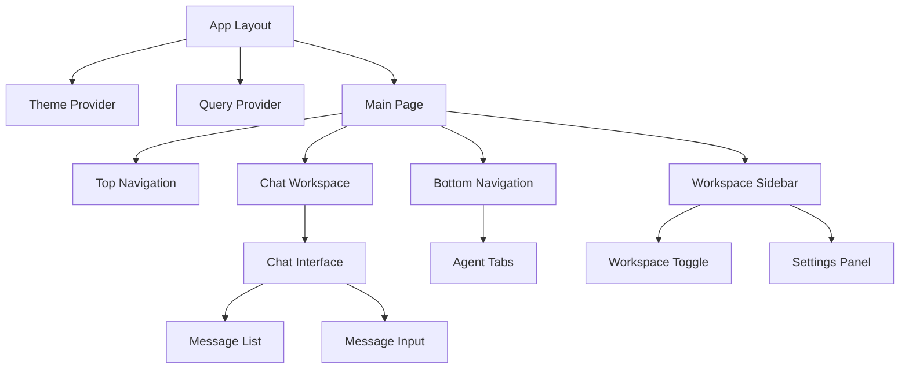
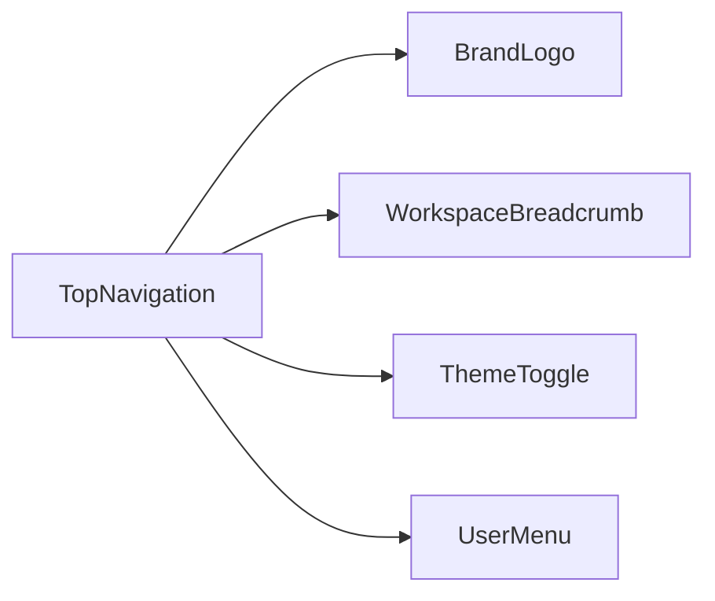
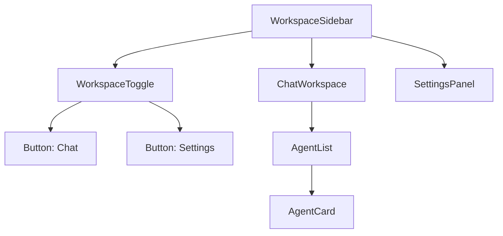
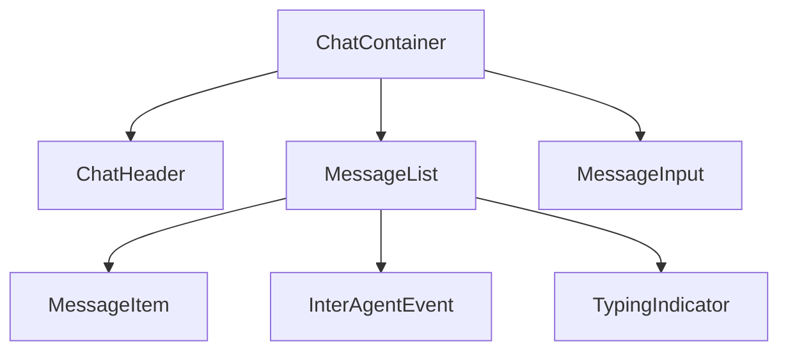
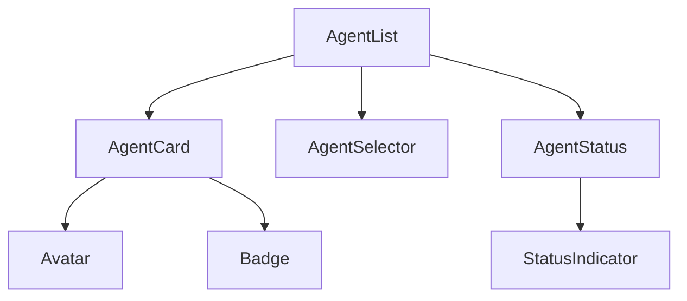
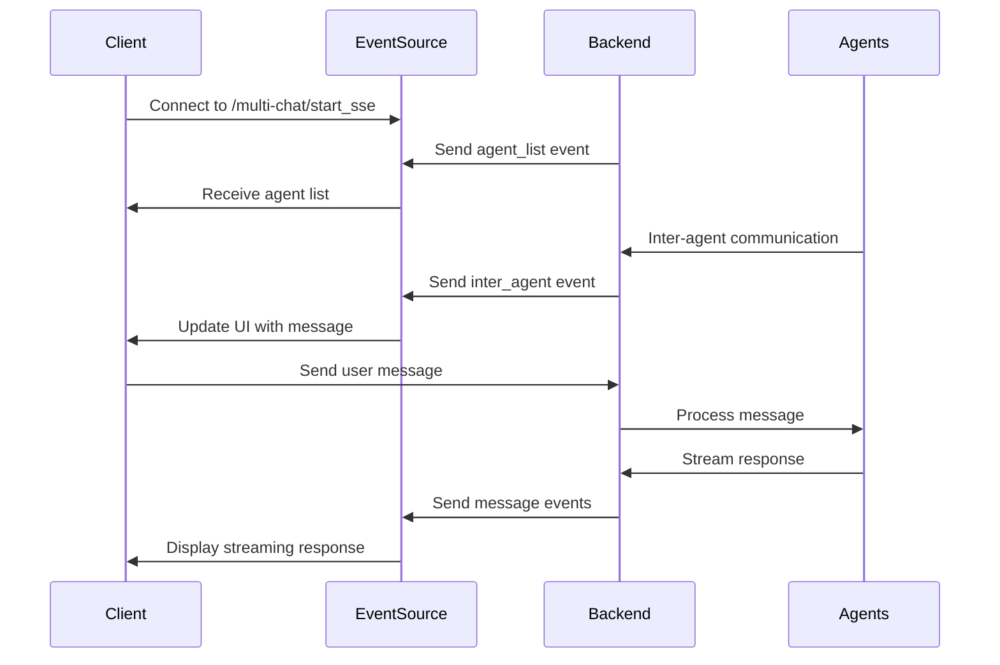

# Multi-Agent Chat UI Design Document

## Overview

This document outlines the design for a Google ADK-compatible multi-agent chat interface using Next.js, shadcn-ui, and Tailwind CSS. The application will enable real-time communication with multiple AI agents simultaneously, featuring inter-agent communication visualization and workspace management.

## Technology Stack & Dependencies

### Frontend Framework
- **Next.js 15+** with App Router
- **TypeScript** for type safety
- **Tailwind CSS v4** for styling utilities

### Component Library
- **shadcn-ui** components including:
  - Dialog, Sheet, Tabs, Button, Input, Textarea
  - Avatar, Badge, Card, ScrollArea
  - Toggle (for dark mode), Select, Separator
  - Alert, Toast notifications

### State Management
- **Zustand** for global state management
- React Query (TanStack Query) for server state

### Real-time Communication
- **EventSource API** for Server-Sent Events (SSE)
- **Fetch API** for HTTP requests

### Additional Dependencies
- **clsx** and **class-variance-authority** for conditional styling
- **lucide-react** for icons
- **date-fns** for date formatting

## Architecture

### Application Structure
```
./docker/react-chat/
├── src/
│   ├── app/
│   │   ├── layout.tsx           # Root layout with providers
│   │   ├── page.tsx             # Main chat page
│   │   └── globals.css          # Global styles
│   ├── components/
│   │   ├── ui/                  # shadcn-ui components (via npx init)
│   │   ├── chat/
│   │   │   ├── chat-container.tsx      # Main chat wrapper
│   │   │   ├── chat-header.tsx         # Agent info header
│   │   │   ├── message-list.tsx        # Message display
│   │   │   ├── message-item.tsx        # Individual message
│   │   │   ├── message-input.tsx       # Input component
│   │   │   ├── typing-indicator.tsx    # Typing animation
│   │   │   └── inter-agent-event.tsx   # Inter-agent communication
│   │   ├── agents/
│   │   │   ├── agent-card.tsx          # Agent status card
│   │   │   ├── agent-list.tsx          # Agent overview
│   │   │   ├── agent-selector.tsx      # Agent picker
│   │   │   └── agent-status.tsx        # Status indicator
│   │   ├── workspace/
│   │   │   ├── workspace-sidebar.tsx   # Left sidebar
│   │   │   ├── workspace-toggle.tsx    # Workspace switcher
│   │   │   ├── settings-panel.tsx      # Settings workspace
│   │   │   └── chat-workspace.tsx      # Chat workspace
│   │   ├── navigation/
│   │   │   ├── top-navigation.tsx      # Top nav bar
│   │   │   ├── bottom-navigation.tsx   # Agent tabs
│   │   │   ├── agent-tab.tsx           # Individual agent tab
│   │   │   └── theme-toggle.tsx        # Dark mode switch
│   │   ├── layout/
│   │   │   ├── main-layout.tsx         # App shell
│   │   │   ├── sidebar-layout.tsx      # Sidebar wrapper
│   │   │   └── content-layout.tsx      # Main content area
│   │   └── providers/
│   │       ├── theme-provider.tsx      # Theme context
│   │       ├── query-provider.tsx      # React Query
│   │       └── chat-provider.tsx       # Chat context
│   ├── lib/
│   │   ├── store/
│   │   │   ├── chat-store.ts           # Chat state
│   │   │   ├── workspace-store.ts      # Workspace state
│   │   │   ├── theme-store.ts          # Theme state
│   │   │   └── agents-store.ts         # Agent state
│   │   ├── api/
│   │   │   ├── client.ts               # API client
│   │   │   ├── agents.ts               # Agent API
│   │   │   ├── messages.ts             # Message API
│   │   │   └── sse.ts                  # SSE handling
│   │   ├── types/
│   │   │   ├── agent.ts                # Agent types
│   │   │   ├── message.ts              # Message types
│   │   │   ├── workspace.ts            # Workspace types
│   │   │   └── api.ts                  # API types
│   │   └── utils.ts                    # Utility functions
│   └── hooks/
│       ├── use-agents.ts               # Agent hooks
│       ├── use-messages.ts             # Message hooks
│       ├── use-sse.ts                  # SSE hooks
│       └── use-chat.ts                 # Chat functionality
```

### Component Architecture



## Data Models & Types

### Core Types
```typescript
interface Agent {
  id: string
  name: string
  status: 'online' | 'offline' | 'busy'
  capabilities: string[]
  avatar?: string
}

interface Message {
  id: string
  content: string
  timestamp: Date
  sender: 'user' | Agent['id']
  type: 'user' | 'agent' | 'inter_agent'
  metadata?: {
    fromAgent?: string
    toAgent?: string
    eventType?: string
  }
}

interface ChatSession {
  agentId: string
  messages: Message[]
  isActive: boolean
  lastActivity: Date
}

interface InterAgentEvent {
  id: string
  type: 'communication' | 'heartbeat' | 'agent_list'
  fromAgent: string
  toAgent: string
  content: string
  timestamp: Date
}
```

### Store Interfaces
```typescript
interface ChatStore {
  agents: Agent[]
  sessions: Record<string, ChatSession>
  activeAgentId: string | null
  isConnected: boolean

  // Actions
  setAgents: (agents: Agent[]) => void
  addMessage: (agentId: string, message: Message) => void
  setActiveAgent: (agentId: string) => void
  sendMessage: (agentId: string, content: string) => Promise<void>
}

interface WorkspaceStore {
  activeWorkspace: 'chat' | 'settings'
  sidebarOpen: boolean

  // Actions
  setActiveWorkspace: (workspace: string) => void
  toggleSidebar: () => void
}

interface ThemeStore {
  isDarkMode: boolean
  toggleTheme: () => void
}
```

## Component Design Philosophy

### Code Structure Principles
- **Maximum 500 lines per file** - Components must be split into smaller, focused modules
- **Reusable components** - Build composable UI elements that can be combined
- **Single responsibility** - Each component handles one specific concern
- **shadcn-ui first** - Use official shadcn-ui components, never create custom versions

### shadcn-ui Integration
```bash
# Initialize shadcn-ui in project
npx shadcn-ui@latest init

# Install all available components
npx shadcn-ui@latest add accordion
npx shadcn-ui@latest add alert
npx shadcn-ui@latest add alert-dialog
npx shadcn-ui@latest add aspect-ratio
npx shadcn-ui@latest add avatar
npx shadcn-ui@latest add badge
npx shadcn-ui@latest add breadcrumb
npx shadcn-ui@latest add button
npx shadcn-ui@latest add calendar
npx shadcn-ui@latest add card
npx shadcn-ui@latest add carousel
npx shadcn-ui@latest add checkbox
npx shadcn-ui@latest add collapsible
npx shadcn-ui@latest add command
npx shadcn-ui@latest add context-menu
npx shadcn-ui@latest add dialog
npx shadcn-ui@latest add drawer
npx shadcn-ui@latest add dropdown-menu
npx shadcn-ui@latest add form
npx shadcn-ui@latest add hover-card
npx shadcn-ui@latest add input
npx shadcn-ui@latest add input-otp
npx shadcn-ui@latest add label
npx shadcn-ui@latest add menubar
npx shadcn-ui@latest add navigation-menu
npx shadcn-ui@latest add pagination
npx shadcn-ui@latest add popover
npx shadcn-ui@latest add progress
npx shadcn-ui@latest add radio-group
npx shadcn-ui@latest add resizable
npx shadcn-ui@latest add scroll-area
npx shadcn-ui@latest add select
npx shadcn-ui@latest add separator
npx shadcn-ui@latest add sheet
npx shadcn-ui@latest add skeleton
npx shadcn-ui@latest add slider
npx shadcn-ui@latest add sonner
npx shadcn-ui@latest add switch
npx shadcn-ui@latest add table
npx shadcn-ui@latest add tabs
npx shadcn-ui@latest add textarea
npx shadcn-ui@latest add toast
npx shadcn-ui@latest add toggle
npx shadcn-ui@latest add toggle-group
npx shadcn-ui@latest add tooltip
```

### Component Composition Strategy

#### Top Navigation (< 200 lines)


**shadcn-ui Components Used:**
- `Button` for actions
- `DropdownMenu` for user menu
- `Badge` for workspace indicator
- `Switch` for theme toggle

#### Workspace Sidebar (< 300 lines)


**shadcn-ui Components Used:**
- `Sheet` for sidebar container
- `Tabs` for workspace switching
- `Card` for agent cards
- `Badge` for agent status
- `ScrollArea` for scrolling content

#### Chat Interface (< 400 lines split across 4 files)


**File Breakdown:**
- `chat-container.tsx` (< 150 lines) - Main wrapper
- `message-list.tsx` (< 200 lines) - Message display logic
- `message-item.tsx` (< 100 lines) - Individual message rendering
- `message-input.tsx` (< 150 lines) - Input handling

**shadcn-ui Components Used:**
- `Card` for message containers
- `ScrollArea` for message list
- `Textarea` for message input
- `Button` for send action
- `Avatar` for agent representation
- `Separator` for visual breaks

#### Agent Management (< 300 lines split across 4 files)


**shadcn-ui Components Used:**
- `Select` for agent selection
- `Avatar` for agent representation
- `Badge` for status indication
- `Card` for agent information
- `Tooltip` for additional info

### Micro-Component Architecture

Each complex component is broken down into focused micro-components:

#### Example: Message Item Breakdown
```typescript
// message-item.tsx (< 100 lines)
export function MessageItem({ message }: MessageItemProps) {
  return (
    <Card>
      <MessageHeader />
      <MessageContent />
      <MessageFooter />
    </Card>
  )
}

// message-header.tsx (< 50 lines)
export function MessageHeader({ sender, timestamp }: HeaderProps) {
  return (
    <div>
      <Avatar />
      <Badge />
    </div>
  )
}
```

### Reusable Component Patterns

#### Status Indicator Component
```typescript
// Reusable across agent cards, message items, navigation
export function StatusIndicator({ status }: StatusProps) {
  return <Badge variant={getStatusVariant(status)}>{status}</Badge>
}
```

#### Loading State Component
```typescript
// Reusable loading states using shadcn-ui Skeleton
export function MessageSkeleton() {
  return (
    <Card>
      <Skeleton className="h-4 w-[250px]" />
      <Skeleton className="h-4 w-[200px]" />
    </Card>
  )
}
```

## Component Guidelines & Best Practices

### File Size Management
- **Maximum 500 lines per component file**
- **Split complex components into smaller modules**
- **Use composition over large monolithic components**
- **Extract reusable logic into custom hooks**

### shadcn-ui Usage Rules
- **Never create custom versions of existing shadcn-ui components**
- **Always use official shadcn-ui components via `npx shadcn-ui add`**
- **Extend functionality through composition, not modification**
- **Follow shadcn-ui theming conventions**

### Component Composition Examples

#### Chat Message Composition
```typescript
// Good: Composed from multiple small components
export function ChatMessage({ message }: ChatMessageProps) {
  return (
    <Card className="mb-4">
      <MessageHeader sender={message.sender} timestamp={message.timestamp} />
      <MessageContent content={message.content} type={message.type} />
      <MessageActions messageId={message.id} />
    </Card>
  )
}

// Each sub-component < 100 lines
export function MessageHeader({ sender, timestamp }: HeaderProps) { /* < 50 lines */ }
export function MessageContent({ content, type }: ContentProps) { /* < 100 lines */ }
export function MessageActions({ messageId }: ActionsProps) { /* < 50 lines */ }
```

#### Navigation Composition
```typescript
// Good: Small, focused navigation components
export function BottomNavigation({ agents }: NavigationProps) {
  return (
    <Tabs value={activeAgent} onValueChange={setActiveAgent}>
      <TabsList>
        {agents.map(agent => (
          <AgentTab key={agent.id} agent={agent} />
        ))}
      </TabsList>
    </Tabs>
  )
}

// AgentTab component < 80 lines
export function AgentTab({ agent }: AgentTabProps) {
  return (
    <TabsTrigger value={agent.id}>
      <AgentStatusIndicator status={agent.status} />
      <span>{agent.name}</span>
    </TabsTrigger>
  )
}
```

### Required shadcn-ui Component Integration

#### Core Layout Components
- `Card` - Message containers, agent cards, panels
- `Tabs` - Agent switching, workspace navigation
- `Sheet` - Sidebar implementation
- `ScrollArea` - Message lists, agent lists
- `Separator` - Visual breaks between sections

#### Form & Input Components
- `Textarea` - Message input
- `Button` - All interactive actions
- `Select` - Agent selection, settings
- `Switch` - Theme toggle, settings
- `Label` - Form field labels

#### Feedback Components
- `Badge` - Agent status, message types
- `Avatar` - Agent representation
- `Skeleton` - Loading states
- `Toast` - Notifications
- `Alert` - Error states, system messages

#### Navigation Components
- `DropdownMenu` - User menu, context menus
- `Tooltip` - Additional information
- `Breadcrumb` - Workspace navigation
- `NavigationMenu` - Main navigation

## API Integration Layer

### Backend Communication
```typescript
class ApiService {
  private baseUrl: string
  private eventSource: EventSource | null = null

  // Agent discovery
  async getAgents(): Promise<Agent[]>

  // Message sending
  async sendMessage(agentId: string, content: string): Promise<void>

  // SSE connection
  startSSEConnection(agentIds: string[]): EventSource

  // Inter-agent messaging
  async sendInterAgentMessage(
    fromAgent: string,
    toAgent: string,
    content: string
  ): Promise<void>
}
```

### Server-Sent Events Handling
```typescript
interface SSEEventHandler {
  onMessage: (message: Message) => void
  onInterAgentEvent: (event: InterAgentEvent) => void
  onAgentStatusChange: (agentId: string, status: Agent['status']) => void
  onConnectionStatusChange: (connected: boolean) => void
}
```

## State Management Strategy
### Zustand Store Organization
```typescript
// Chat store - manages chat sessions and messages
const useChatStore = create<ChatStore>((set, get) => ({
  // State and actions for chat functionality
}))

// Workspace store - manages UI state
const useWorkspaceStore = create<WorkspaceStore>((set) => ({
  // State and actions for workspace management
}))

// Theme store - manages theme state
const useThemeStore = create<ThemeStore>((set) => ({
  // State and actions for theme switching
}))
```

### React Query Integration
```typescript
// Agent queries
const useAgents = () => useQuery({
  queryKey: ['agents'],
  queryFn: () => apiService.getAgents(),
  refetchInterval: 30000 // Refresh agent list every 30s
})

// Message mutations
const useSendMessage = () => useMutation({
  mutationFn: ({ agentId, content }: SendMessageParams) =>
    apiService.sendMessage(agentId, content),
  onSuccess: (data, variables) => {
    // Update local state
    chatStore.getState().addMessage(variables.agentId, data)
  }
})
```

## Styling Strategy

### Tailwind CSS Configuration
```typescript
// tailwind.config.js
module.exports = {
  content: ['./src/**/*.{js,ts,jsx,tsx}'],
  theme: {
    extend: {
      colors: {
        // Custom color palette for agents
        agent: {
          primary: 'hsl(var(--agent-primary))',
          secondary: 'hsl(var(--agent-secondary))',
        }
      },
      animation: {
        'message-slide': 'slide-up 0.3s ease-out',
        'typing': 'pulse 1.5s infinite',
      }
    }
  },
  plugins: [require('tailwindcss-animate')]
}
```

### Component Styling Patterns
- **Consistent spacing** using Tailwind's spacing scale
- **Color-coded agents** with dynamic CSS variables
- **Responsive design** with mobile-first approach
- **Dark mode support** via CSS variables and theme context
- **Smooth animations** for message appearance and UI transitions

## Real-time Communication Architecture

### SSE Event Processing


### Event Types & Handling
```typescript
interface EventHandlers {
  'agent_list': (data: Agent[]) => void
  'message': (data: Message) => void
  'inter_agent': (data: InterAgentEvent) => void
  'heartbeat': (data: { timestamp: number }) => void
  'error': (data: { message: string }) => void
}
```

## User Experience Features

### Multi-Agent Chat Flow
1. **Agent Discovery**: Automatically detect and display online agents
2. **Session Creation**: Create chat sessions for each agent
3. **Message Exchange**: Send messages to specific agents
4. **Inter-Agent Monitoring**: Visualize agent-to-agent communication
5. **Context Switching**: Seamlessly switch between agent conversations

### Workspace Management
- **Chat Workspace**: Primary interface for agent interactions
- **Settings Workspace**: Configuration and preferences
- **Smooth Transitions**: Animated workspace switching
- **State Persistence**: Maintain chat state across workspace changes

### Responsive Design
- **Desktop**: Full layout with sidebar and multiple panels
- **Tablet**: Collapsible sidebar, bottom navigation prominent
- **Mobile**: Stack layout, drawer navigation, simplified UI

## Component Guidelines & Best Practices

### File Size Management
- **Maximum 500 lines per component file**
- **Split complex components into smaller modules**
- **Use composition over large monolithic components**
- **Extract reusable logic into custom hooks**

### shadcn-ui Usage Rules
- **Never create custom versions of existing shadcn-ui components**
- **Always use official shadcn-ui components via `npx shadcn-ui add`**
- **Extend functionality through composition, not modification**
- **Follow shadcn-ui theming conventions**

### Component Composition Examples

#### Chat Message Composition
```typescript
// Good: Composed from multiple small components
export function ChatMessage({ message }: ChatMessageProps) {
  return (
    <Card className="mb-4">
      <MessageHeader sender={message.sender} timestamp={message.timestamp} />
      <MessageContent content={message.content} type={message.type} />
      <MessageActions messageId={message.id} />
    </Card>
  )
}

// Each sub-component < 100 lines
export function MessageHeader({ sender, timestamp }: HeaderProps) { /* < 50 lines */ }
export function MessageContent({ content, type }: ContentProps) { /* < 100 lines */ }
export function MessageActions({ messageId }: ActionsProps) { /* < 50 lines */ }
```

#### Navigation Composition
```typescript
// Good: Small, focused navigation components
export function BottomNavigation({ agents }: NavigationProps) {
  return (
    <Tabs value={activeAgent} onValueChange={setActiveAgent}>
      <TabsList>
        {agents.map(agent => (
          <AgentTab key={agent.id} agent={agent} />
        ))}
      </TabsList>
    </Tabs>
  )
}

// AgentTab component < 80 lines
export function AgentTab({ agent }: AgentTabProps) {
  return (
    <TabsTrigger value={agent.id}>
      <AgentStatusIndicator status={agent.status} />
      <span>{agent.name}</span>
    </TabsTrigger>
  )
}
```

### Required shadcn-ui Component Integration

#### Core Layout Components
- `Card` - Message containers, agent cards, panels
- `Tabs` - Agent switching, workspace navigation
- `Sheet` - Sidebar implementation
- `ScrollArea` - Message lists, agent lists
- `Separator` - Visual breaks between sections

#### Form & Input Components
- `Textarea` - Message input
- `Button` - All interactive actions
- `Select` - Agent selection, settings
- `Switch` - Theme toggle, settings
- `Label` - Form field labels

#### Feedback Components
- `Badge` - Agent status, message types
- `Avatar` - Agent representation
- `Skeleton` - Loading states
- `Toast` - Notifications
- `Alert` - Error states, system messages

#### Navigation Components
- `DropdownMenu` - User menu, context menus
- `Tooltip` - Additional information
- `Breadcrumb` - Workspace navigation
- `NavigationMenu` - Main navigation

### Testing Strategy

#### Component Testing (< 200 lines per test file)
- **Unit tests** for individual micro-components
- **Integration tests** for composed components
- **Mock shadcn-ui components** for testing
- **Accessibility testing** for all UI components

#### State Management Testing
- **Zustand store testing** with isolated store instances
- **React Query testing** with mock API responses
- **Custom hook testing** for chat functionality

#### Visual Testing
- **Storybook integration** for component documentation
- **Visual regression testing** for UI consistency
- **Responsive design testing** across breakpoints
