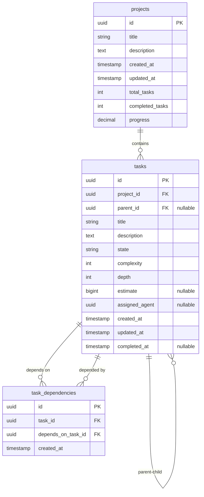

# PostgreSQL Repository Implementation Design

## Overview

This design document outlines the implementation of a PostgreSQL-based repository for the project management tool using Facebook's ent ORM framework. The implementation will replace the current in-memory repository while maintaining full compatibility with the existing Repository interface.

## Technology Stack & Dependencies

### Core Technologies
- **Database**: PostgreSQL 13+
- **ORM Framework**: Facebook ent (entgo.io/ent)
- **Database Driver**: pgx/v5 (PostgreSQL driver)
- **Migration Strategy**: Ent Auto-Migration for development

### New Dependencies Required
```go
// go.mod additions
entgo.io/ent v0.12.5
github.com/lib/pq v1.10.9
github.com/jackc/pgx/v5 v5.5.0
```

## Architecture

### Database Schema Design

#### Entity Relationship Diagram


### Ent Schema Definitions

#### Project Schema
```go
// ent/schema/project.go
package schema

import (
    "time"
    "entgo.io/ent"
    "entgo.io/ent/schema/field"
    "entgo.io/ent/schema/edge"
    "github.com/google/uuid"
)

type Project struct {
    ent.Schema
}

func (Project) Fields() []ent.Field {
    return []ent.Field{
        field.UUID("id", uuid.UUID{}).Default(uuid.New).Unique(),
        field.String("title").MaxLen(200).NotEmpty(),
        field.Text("description").Optional(),
        field.Time("created_at").Default(time.Now),
        field.Time("updated_at").Default(time.Now).UpdateDefault(time.Now),
        field.Int("total_tasks").Default(0),
        field.Int("completed_tasks").Default(0),
        field.Float("progress").Default(0.0),
    }
}

func (Project) Edges() []ent.Edge {
    return []ent.Edge{
        edge.To("tasks", Task.Type),
    }
}

func (Project) Indexes() []ent.Index {
    return []ent.Index{
        index.Fields("created_at"),
        index.Fields("title"),
    }
}
```

#### Task Schema
```go
// ent/schema/task.go
package schema

import (
    "time"
    "entgo.io/ent"
    "entgo.io/ent/schema/field"
    "entgo.io/ent/schema/edge"
    "entgo.io/ent/schema/index"
    "github.com/google/uuid"
)

type Task struct {
    ent.Schema
}

func (Task) Fields() []ent.Field {
    return []ent.Field{
        field.UUID("id", uuid.UUID{}).Default(uuid.New).Unique(),
        field.UUID("project_id", uuid.UUID{}),
        field.UUID("parent_id", uuid.UUID{}).Optional().Nillable(),
        field.String("title").MaxLen(200).NotEmpty(),
        field.Text("description").Optional(),
        field.Enum("state").Values(
            "pending", "in-progress", "completed", "blocked", "cancelled",
        ).Default("pending"),
        field.Int("complexity").Min(1).Max(10),
        field.Int("depth").Default(0),
        field.Int64("estimate").Optional().Nillable(),
        field.UUID("assigned_agent", uuid.UUID{}).Optional().Nillable(),
        field.Time("created_at").Default(time.Now),
        field.Time("updated_at").Default(time.Now).UpdateDefault(time.Now),
        field.Time("completed_at").Optional().Nillable(),
    }
}

func (Task) Edges() []ent.Edge {
    return []ent.Edge{
        edge.From("project", Project.Type).
            Ref("tasks").
            Field("project_id").
            Unique().
            Required(),
        edge.To("children", Task.Type).
            From("parent").
            Field("parent_id").
            Unique(),
        edge.To("dependencies", Task.Type).
            Through("task_dependencies", TaskDependency.Type),
        edge.From("dependents", Task.Type).
            Ref("dependencies").
            Through("dependent_task_dependencies", TaskDependency.Type),
    }
}

func (Task) Indexes() []ent.Index {
    return []ent.Index{
        index.Fields("project_id"),
        index.Fields("parent_id"),
        index.Fields("state"),
        index.Fields("assigned_agent"),
        index.Fields("complexity"),
        index.Fields("depth"),
        index.Fields("project_id", "state"),
        index.Fields("project_id", "assigned_agent"),
        index.Fields("created_at"),
    }
}
```

#### TaskDependency Schema
```go
// ent/schema/taskdependency.go
package schema

import (
    "time"
    "entgo.io/ent"
    "entgo.io/ent/schema/field"
    "entgo.io/ent/schema/edge"
    "entgo.io/ent/schema/index"
    "github.com/google/uuid"
)

type TaskDependency struct {
    ent.Schema
}

func (TaskDependency) Fields() []ent.Field {
    return []ent.Field{
        field.UUID("id", uuid.UUID{}).Default(uuid.New).Unique(),
        field.UUID("task_id", uuid.UUID{}),
        field.UUID("depends_on_task_id", uuid.UUID{}),
        field.Time("created_at").Default(time.Now),
    }
}

func (TaskDependency) Edges() []ent.Edge {
    return []ent.Edge{
        edge.To("task", Task.Type).
            Field("task_id").
            Unique().
            Required(),
        edge.To("depends_on_task", Task.Type).
            Field("depends_on_task_id").
            Unique().
            Required(),
    }
}

func (TaskDependency) Indexes() []ent.Index {
    return []ent.Index{
        index.Fields("task_id"),
        index.Fields("depends_on_task_id"),
        index.Fields("task_id", "depends_on_task_id").Unique(),
    }
}
```

## Repository Implementation

### Package Structure
```
pkg/tools/project/repository/
├── options.go              # Configuration options
├── errors.go               # Custom error types
├── repository.go           # Main repository implementation
├── transactions.go         # Transaction management
├── migrations.go           # Auto-migration setup
├── mappers.go              # Entity to domain model mapping
├── queries.go              # Complex query implementations
└── ent/                    # Ent generated code
    ├── schema/
    │   ├── project.go
    │   ├── task.go
    └── └── taskdependency.go
```

### Configuration & Options Pattern

```go
// options.go
package repository

import (
    "context"
    "time"
)

type Config struct {
    DatabaseURL      string
    MaxOpenConns     int
    MaxIdleConns     int
    ConnMaxLifetime  time.Duration
    ConnMaxIdleTime  time.Duration
    AutoMigrate      bool
    MigrationTimeout time.Duration
}

type Option func(*postgresRepository)

func WithConfig(config *Config) Option {
    return func(r *postgresRepository) {
        r.config = config
    }
}

func WithAutoMigrate(enable bool) Option {
    return func(r *postgresRepository) {
        r.config.AutoMigrate = enable
    }
}

func WithConnectionPool(maxOpen, maxIdle int) Option {
    return func(r *postgresRepository) {
        r.config.MaxOpenConns = maxOpen
        r.config.MaxIdleConns = maxIdle
    }
}
```

### Error Handling Strategy

```go
// errors.go
package repository

import (
    "errors"
    "fmt"
)

type RepositoryError struct {
    Type    ErrorType
    Message string
    Cause   error
}

type ErrorType int

const (
    ErrorTypeNotFound ErrorType = iota
    ErrorTypeConstraintViolation
    ErrorTypeCircularDependency
    ErrorTypeMaxDepthExceeded
    ErrorTypeMaxTasksExceeded
    ErrorTypeConnectionError
    ErrorTypeTransactionError
    ErrorTypeMigrationError
)

func (e *RepositoryError) Error() string {
    if e.Cause != nil {
        return fmt.Sprintf("%s: %v", e.Message, e.Cause)
    }
    return e.Message
}

func NewNotFoundError(entity string, id string) *RepositoryError {
    return &RepositoryError{
        Type:    ErrorTypeNotFound,
        Message: fmt.Sprintf("%s with ID %s not found", entity, id),
    }
}

func NewConstraintViolationError(constraint string, cause error) *RepositoryError {
    return &RepositoryError{
        Type:    ErrorTypeConstraintViolation,
        Message: fmt.Sprintf("constraint violation: %s", constraint),
        Cause:   cause,
    }
}
```

### Main Repository Implementation

```go
// repository.go
package repository

import (
    "context"
    "database/sql"
    "entgo.io/ent/dialect"
    entsql "entgo.io/ent/dialect/sql"
    "github.com/denkhaus/agents/pkg/tools/project"
    "github.com/denkhaus/agents/pkg/tools/project/repository/ent"
    "github.com/google/uuid"
    _ "github.com/lib/pq"
)

type postgresRepository struct {
    client *ent.Client
    config *Config
}

func NewPostgresRepository(databaseURL string, opts ...Option) (project.Repository, error) {
    config := &Config{
        DatabaseURL:      databaseURL,
        MaxOpenConns:     25,
        MaxIdleConns:     5,
        ConnMaxLifetime:  time.Hour,
        ConnMaxIdleTime:  time.Minute * 15,
        AutoMigrate:      true,
        MigrationTimeout: time.Minute * 5,
    }

    repo := &postgresRepository{
        config: config,
    }

    for _, opt := range opts {
        opt(repo)
    }

    if err := repo.initialize(); err != nil {
        return nil, fmt.Errorf("failed to initialize repository: %w", err)
    }

    return repo, nil
}

func (r *postgresRepository) initialize() error {
    db, err := sql.Open("postgres", r.config.DatabaseURL)
    if err != nil {
        return NewConnectionError("failed to open database connection", err)
    }

    // Configure connection pool
    db.SetMaxOpenConns(r.config.MaxOpenConns)
    db.SetMaxIdleConns(r.config.MaxIdleConns)
    db.SetConnMaxLifetime(r.config.ConnMaxLifetime)
    db.SetConnMaxIdleTime(r.config.ConnMaxIdleTime)

    // Test connection
    if err := db.Ping(); err != nil {
        return NewConnectionError("failed to ping database", err)
    }

    // Create ent client
    drv := entsql.OpenDB(dialect.Postgres, db)
    r.client = ent.NewClient(ent.Driver(drv))

    // Run auto-migration if enabled
    if r.config.AutoMigrate {
        ctx, cancel := context.WithTimeout(context.Background(), r.config.MigrationTimeout)
        defer cancel()

        if err := r.client.Schema.Create(ctx); err != nil {
            return NewMigrationError("auto-migration failed", err)
        }
    }

    return nil
}

func (r *postgresRepository) Close() error {
    if r.client != nil {
        return r.client.Close()
    }
    return nil
}
```

### Data Mapping Layer

```go
// mappers.go
package repository

import (
    "github.com/denkhaus/agents/pkg/tools/project"
    "github.com/denkhaus/agents/pkg/tools/project/repository/ent"
)

// Project entity mapping
func entProjectToProject(ep *ent.Project) *project.Project {
    return &project.Project{
        ID:             ep.ID,
        Title:          ep.Title,
        Description:    ep.Description,
        CreatedAt:      ep.CreatedAt,
        UpdatedAt:      ep.UpdatedAt,
        TotalTasks:     ep.TotalTasks,
        CompletedTasks: ep.CompletedTasks,
        Progress:       ep.Progress,
    }
}

func projectToEntProject(p *project.Project) *ent.ProjectCreate {
    return ent.Project.Create().
        SetID(p.ID).
        SetTitle(p.Title).
        SetDescription(p.Description).
        SetCreatedAt(p.CreatedAt).
        SetUpdatedAt(p.UpdatedAt).
        SetTotalTasks(p.TotalTasks).
        SetCompletedTasks(p.CompletedTasks).
        SetProgress(p.Progress)
}

// Task entity mapping
func entTaskToTask(et *ent.Task) *project.Task {
    task := &project.Task{
        ID:          et.ID,
        ProjectID:   et.ProjectID,
        Title:       et.Title,
        Description: et.Description,
        State:       project.TaskState(et.State),
        Complexity:  et.Complexity,
        Depth:       et.Depth,
        CreatedAt:   et.CreatedAt,
        UpdatedAt:   et.UpdatedAt,
    }

    if et.ParentID != nil {
        task.ParentID = et.ParentID
    }
    if et.Estimate != nil {
        task.Estimate = et.Estimate
    }
    if et.AssignedAgent != nil {
        task.AssignedAgent = et.AssignedAgent
    }
    if et.CompletedAt != nil {
        task.CompletedAt = et.CompletedAt
    }

    return task
}

func taskToEntTaskCreate(t *project.Task) *ent.TaskCreate {
    create := ent.Task.Create().
        SetID(t.ID).
        SetProjectID(t.ProjectID).
        SetTitle(t.Title).
        SetDescription(t.Description).
        SetState(string(t.State)).
        SetComplexity(t.Complexity).
        SetDepth(t.Depth).
        SetCreatedAt(t.CreatedAt).
        SetUpdatedAt(t.UpdatedAt)

    if t.ParentID != nil {
        create.SetParentID(*t.ParentID)
    }
    if t.Estimate != nil {
        create.SetEstimate(*t.Estimate)
    }
    if t.AssignedAgent != nil {
        create.SetAssignedAgent(*t.AssignedAgent)
    }
    if t.CompletedAt != nil {
        create.SetCompletedAt(*t.CompletedAt)
    }

    return create
}
```

### Transaction Management

```go
// transactions.go
package repository

import (
    "context"
    "fmt"
    "github.com/denkhaus/agents/pkg/tools/project/repository/ent"
)

type TxFunc func(ctx context.Context, tx *ent.Tx) error

func (r *postgresRepository) withTx(ctx context.Context, fn TxFunc) error {
    tx, err := r.client.Tx(ctx)
    if err != nil {
        return NewTransactionError("failed to begin transaction", err)
    }

    defer func() {
        if p := recover(); p != nil {
            tx.Rollback()
            panic(p)
        } else if err != nil {
            tx.Rollback()
        } else {
            err = tx.Commit()
            if err != nil {
                err = NewTransactionError("failed to commit transaction", err)
            }
        }
    }()

    err = fn(ctx, tx)
    return err
}

// Complex transactional operations
func (r *postgresRepository) DeleteTaskSubtree(ctx context.Context, taskID uuid.UUID) error {
    return r.withTx(ctx, func(ctx context.Context, tx *ent.Tx) error {
        // Get all descendant tasks using recursive CTE
        descendantIDs, err := r.getDescendantTaskIDs(ctx, tx, taskID)
        if err != nil {
            return err
        }

        // Add the root task to the list
        allTaskIDs := append(descendantIDs, taskID)

        // Delete all task dependencies
        _, err = tx.TaskDependency.Delete().
            Where(taskdependency.Or(
                taskdependency.TaskIDIn(allTaskIDs...),
                taskdependency.DependsOnTaskIDIn(allTaskIDs...),
            )).
            Exec(ctx)
        if err != nil {
            return fmt.Errorf("failed to delete task dependencies: %w", err)
        }

        // Delete all tasks (children first due to foreign key constraints)
        _, err = tx.Task.Delete().
            Where(task.IDIn(allTaskIDs...)).
            Exec(ctx)
        if err != nil {
            return fmt.Errorf("failed to delete tasks: %w", err)
        }

        return nil
    })
}
```

## Business Logic Layer

### CRUD Operations Implementation

```go
// Project CRUD Operations
func (r *postgresRepository) CreateProject(ctx context.Context, project *project.Project) error {
    _, err := projectToEntProject(project).Save(ctx)
    if err != nil {
        return r.mapError("create project", err)
    }
    return nil
}

func (r *postgresRepository) GetProject(ctx context.Context, id uuid.UUID) (*project.Project, error) {
    entProject, err := r.client.Project.Get(ctx, id)
    if err != nil {
        if ent.IsNotFound(err) {
            return nil, NewNotFoundError("project", id.String())
        }
        return nil, r.mapError("get project", err)
    }
    return entProjectToProject(entProject), nil
}

// Task CRUD Operations with dependency handling
func (r *postgresRepository) CreateTask(ctx context.Context, task *project.Task) error {
    return r.withTx(ctx, func(ctx context.Context, tx *ent.Tx) error {
        // Create the task
        _, err := taskToEntTaskCreate(task).Save(ctx)
        if err != nil {
            return fmt.Errorf("failed to create task: %w", err)
        }

        // Create dependency relationships if any
        if len(task.Dependencies) > 0 {
            bulk := make([]*ent.TaskDependencyCreate, len(task.Dependencies))
            for i, depID := range task.Dependencies {
                bulk[i] = tx.TaskDependency.Create().
                    SetTaskID(task.ID).
                    SetDependsOnTaskID(depID)
            }
            if _, err := tx.TaskDependency.CreateBulk(bulk...).Save(ctx); err != nil {
                return fmt.Errorf("failed to create task dependencies: %w", err)
            }
        }

        // Update project metrics
        return r.updateProjectMetricsInTx(ctx, tx, task.ProjectID)
    })
}
```

### Complex Query Operations

```go
// queries.go
package repository

// GetTasksByProject with efficient querying
func (r *postgresRepository) GetTasksByProject(ctx context.Context, projectID uuid.UUID) ([]*project.Task, error) {
    entTasks, err := r.client.Task.Query().
        Where(task.ProjectID(projectID)).
        WithDependencies().
        Order(ent.Asc(task.FieldCreatedAt)).
        All(ctx)
    if err != nil {
        return nil, r.mapError("get tasks by project", err)
    }

    tasks := make([]*project.Task, len(entTasks))
    for i, et := range entTasks {
        t := entTaskToTask(et)
        // Map dependencies
        for _, dep := range et.Edges.Dependencies {
            t.Dependencies = append(t.Dependencies, dep.ID)
        }
        tasks[i] = t
    }

    return tasks, nil
}

// GetProjectProgress with aggregated queries
func (r *postgresRepository) GetProjectProgress(ctx context.Context, projectID uuid.UUID) (*project.ProjectProgress, error) {
    // Use aggregation query for performance
    var result struct {
        TotalTasks      int
        CompletedTasks  int
        InProgressTasks int
        PendingTasks    int
        BlockedTasks    int
        CancelledTasks  int
    }

    err := r.client.Task.Query().
        Where(task.ProjectID(projectID)).
        Aggregate(
            ent.Count(),
        ).
        GroupBy(task.FieldState).
        Scan(ctx, &result)

    if err != nil {
        return nil, r.mapError("get project progress", err)
    }

    progress := &project.ProjectProgress{
        ProjectID:       projectID,
        TotalTasks:      result.TotalTasks,
        CompletedTasks:  result.CompletedTasks,
        InProgressTasks: result.InProgressTasks,
        PendingTasks:    result.PendingTasks,
        BlockedTasks:    result.BlockedTasks,
        CancelledTasks:  result.CancelledTasks,
        TasksByDepth:    make(map[int]int),
    }

    if progress.TotalTasks > 0 {
        progress.OverallProgress = float64(progress.CompletedTasks) / float64(progress.TotalTasks) * 100.0
    }

    return progress, nil
}
```

## Testing Strategy

### Unit Testing Framework
```go
// repository_test.go
package repository

import (
    "context"
    "testing"
    "github.com/stretchr/testify/suite"
    "github.com/testcontainers/testcontainers-go"
    "github.com/testcontainers/testcontainers-go/postgres"
)

type RepositoryTestSuite struct {
    suite.Suite
    container testcontainers.Container
    repo      project.Repository
    ctx       context.Context
}

func (suite *RepositoryTestSuite) SetupSuite() {
    suite.ctx = context.Background()

    // Start PostgreSQL test container
    pgContainer, err := postgres.RunContainer(suite.ctx,
        testcontainers.WithImage("postgres:15"),
        postgres.WithDatabase("testdb"),
        postgres.WithUsername("test"),
        postgres.WithPassword("test"),
        testcontainers.WithWaitStrategy(wait.ForLog("database system is ready to accept connections")),
    )
    suite.Require().NoError(err)

    suite.container = pgContainer

    // Get connection string
    connStr, err := pgContainer.ConnectionString(suite.ctx, "sslmode=disable")
    suite.Require().NoError(err)

    // Create repository
    suite.repo, err = NewPostgresRepository(connStr)
    suite.Require().NoError(err)
}

func (suite *RepositoryTestSuite) TearDownSuite() {
    if suite.container != nil {
        suite.container.Terminate(suite.ctx)
    }
}

func (suite *RepositoryTestSuite) TestProjectCRUD() {
    // Test implementation matching existing memory repository tests
}

func TestRepositoryTestSuite(t *testing.T) {
    suite.Run(t, new(RepositoryTestSuite))
}
```

### Integration Testing
- Full database integration tests using testcontainers
- Performance benchmarks comparing with memory repository
- Transaction rollback testing
- Concurrent access testing
- Migration testing

## Migration & Deployment

### Auto-Migration Setup
```go
// migrations.go
package repository

import (
    "context"
    "time"
    "github.com/denkhaus/agents/pkg/tools/project/repository/ent/migrate"
)

func (r *postgresRepository) RunMigrations(ctx context.Context) error {
    ctx, cancel := context.WithTimeout(ctx, r.config.MigrationTimeout)
    defer cancel()

    return r.client.Schema.Create(ctx,
        migrate.WithDropIndex(true),
        migrate.WithDropColumn(true),
        migrate.WithForeignKeys(true),
    )
}

func (r *postgresRepository) ValidateSchema(ctx context.Context) error {
    // Validate that current database schema matches expected schema
    return r.client.Schema.Diff(ctx)
}
```

### Configuration Integration
```go
// Integration with existing project options
func WithPostgresRepository(databaseURL string, opts ...repository.Option) project.Option {
    return func(pts *projectTaskToolSet) {
        repo, err := repository.NewPostgresRepository(databaseURL, opts...)
        if err != nil {
            panic(fmt.Sprintf("failed to create postgres repository: %v", err))
        }

        config := project.DefaultConfig()
        if pts.manager != nil {
            config = pts.manager.GetConfig()
        }
        pts.manager = project.NewManagerWithRepository(repo, config)
    }
}
```

## Performance Considerations

### Query Optimization
- Proper indexing strategy for frequent queries
- Use of database-level aggregations for metrics
- Efficient handling of hierarchical queries using CTEs
- Connection pooling optimization

### Caching Strategy
- Repository-level caching for frequently accessed data
- Invalidation strategies for cached data
- Memory-efficient loading of large result sets

### Monitoring & Observability
- Database query performance metrics
- Connection pool monitoring
- Error rate tracking
- Migration status monitoring
